# Developer Guide

* [Acknowledgements](#acknowledgements)
* [Design & Implementation](#design--implementation)
* [Architecture Overview](#architecture-overview)
* [Core Module Roles](#core-module-roles)
* [High-Level Flow Summary](#high-level-flow-summary)
* [Design Principles](#design-principles)
* [Design & Implementation](#design--implementation)
  * [Ui + Command Registry](#ui--command-registry)
  * [Command](#command)
* [Implementation](#implementation)
  * [Adding Expenses](#adding-expenses)
  * [Calculating Average Expenses](#calculating-average-expenses)
  * [Delete Expenses](#delete-expenses)
  * [List Expenses](#list-expenses)
  * [Edit Expenses](#edit-expenses)
  * [Summary of Expenses](#summary-of-expenses)
  * [Sort Expenses](#sort-command)
  * [Help Command](#help-command)
* [Appendix A: Product Scope](#appendix-a-product-scope)
  * [Target User Profile](#target-user-profile)
  * [Value Proposition](#value-proposition)
* [Appendix B: User Stories](#appendix-b-user-stories)
* [Appendix C: Non-Functional Requirements](#appendix-c-non-functional-requirements)
* [Appendix D: Glossary](#appendix-d-glossary)
* [Appendix E: Instructions for manual testing](#appendix-e-instructions-for-manual-testing)

## Acknowledgements

This application takes inspiration from the SE-EDU organization for its User Guide and Developer Guide.

## Design & implementation

FinTrek is a desktop app designed for university students to manage their expenses, optimized for use via the Command Line Interface (CLI).

## Architecture Overview

This diagram presents a high-level overview of the core components
that make up the FinTrek system. It illustrates how input flows
from the user to command execution, expense management, and data
persistence, with shared utilities supporting all layers.

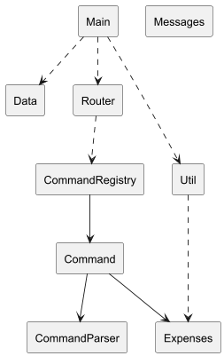
-------------------
Core Module Roles
-------------------

[User]
- Represents the user providing input through the CLI interface.

[Main]
- The entry point of the application.
- Initializes services and launches the UI.

[Ui]
- Interfaces directly with the user.
- Accepts user input and forwards it to the command system.
- Displays output and error messages to the user.

[CommandRegistry]
- Maintains a registry of all supported commands.
- Responsible for resolving input commands to actual Command objects.

[Command]
- Represents the logic behind each user command (e.g., add, edit, list).
- Interacts with budget, expense data and performs operations.

[CommandParser]
- Parses structured arguments (e.g., /edit 2 /d lunch /$ 10).
- Used by commands that require detailed or optional arguments.

[Expenses]
- Manages both regular and recurring expenses.
- Handles all expense-related logic and state.

[Data]
- Responsible for loading and saving expense and budget data.
- Interacts with the file system for persistence.

[Budget]
- Store budget limit information.
- Provide warnings to user if their expenses have exceeded a certain limit.

[Util]
- Provides shared utility functions like input validation and date handling.
- Used across multiple modules for consistency and reuse.

[Messages]
- Central repository of user-facing messages and formatting templates.
- Ensures consistent messaging across the UI and command responses.

-------------------------
High-Level Flow Summary
-------------------------

1. `Main` launches the application and starts `Ui`.
2. `Ui`receives input from `User` and routes it to `CommandRegistry`.
3. `CommandRegistry` locates the correct `Command` to execute.
4. If needed, `Command` invokes `CommandParser` to extract arguments.
5. `Command` operates on `Expenses` to modify data.
6. `Command` interacts with `Budget` to set budget limit.
7. `Expenses` interacts with `Data` to persist changes.
8. Throughout the process, `Util` and `Messages` support validation
   and formatting for consistent behavior and output.

-------------------
Design Principles
-------------------

- Modular and loosely coupled design.
- Commands are pluggable and easy to extend.
- Shared utilities reduce duplication and improve maintainability.
- Centralized message system ensures consistency in user output.

---
# Design & Implementation
## Ui + Command Registry
Here’s a (partial) class diagram of the Ui + Parser + Command Registry component:

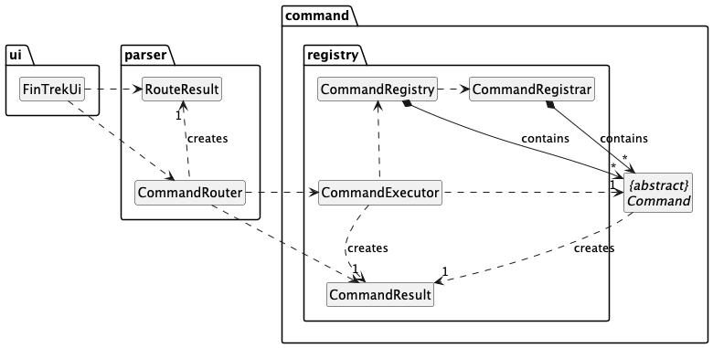

The sequence diagram below illustrates the interactions of Ui and the Command Registry component:

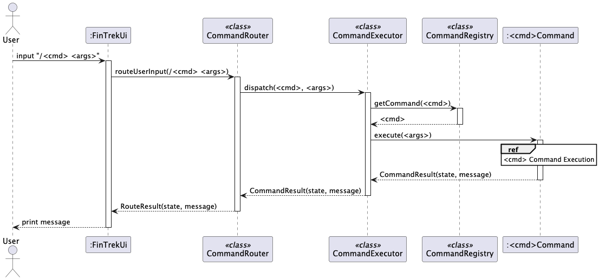

### Example Flow

## Command

Here is a (partial) class diagram of the `Command` abstract class which has some functions overriden by 
classes such as `AddCommand` and `DeleteCommand`: 

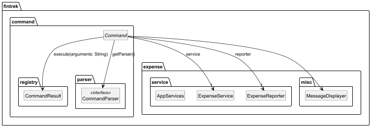

## Implementation

---
> ### ℹ️ Notes about differences for regular and recurring expense
>- The main format difference between these two types is the additional `-recurring` for calling recurring expense functions.
>- In addition, each type has their own manager class: `RegularExpenseManager` and `RecurringExpenseManager` are for regular and recurring expenses respectively.
All the sequential diagrams below will use `RegularExpenseManager` for regular expenses to ensure consistency.

### Adding Expenses
The `/add` command enables users to add an expense into the list of expenses.

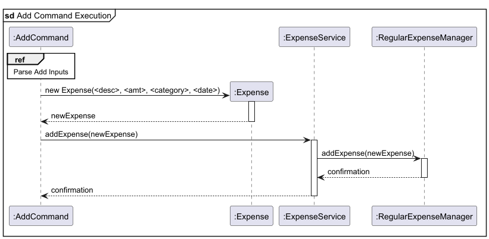

#### Step-by-Step Execution Flow
1. `AddCommand` receives the user's argument, which is in the form `<DESCRIPTION> $<AMOUNT> [/c <CATEGORY>] [/dt <DATE>]`.
2. Through a parsing process to be further explained in the **Parsing** section, the user's
argument is then parsed to obtain the following parameters:

   - `<desc>`: The expense description, limited to 100 characters
   - `<amt>`: The expense amount, a positive number no higher than `1 000 000 000` (one billion)
   - `[<category>]` The expense category, limited to 100 characters, and set by default to `UNCATEGORIZED` if left empty
   - `[<date>]` The date for the expense of the format `dd-MM-yyyy`, which is set by default to today's date
   if left empty

3. `AddCommand` then creates a new `Expense` object called `newExpense`,  by instantiating `new Expense(<desc>, <amt>, <category>, <date>)` which 
is the constructor for the `Expense` object. 

4. `AddCommand` then proceeds to add this new expense into the list:

   - It calls `addExpense(newExpense)` on `ExpenseService`.
   - This internally invokes `addExpense(newExpense)` on `RegularExpenseManager`
   - `RegularExpenseManager` then adds `newExpense` into the current list of expenses, and the confirmation is
   subsequently returned to `AddCommand`

### Delete Expenses

The `/delete` command enables users to remove an expense from the expense list by specifying its index.

#### Step-by-Step Execution Flow

1. DeleteCommand receives the user's argument (e.g., an index to delete).

2. The command first checks for invalid or missing input:
   - Calls InputValidator.isNullOrBlank(args)
   - If the input is blank or null, an error is returned.

3. It then checks whether the input is a valid positive integer:
   - Calls InputValidator.isValidPositiveInteger(args)
   - This ensures the input is a proper index number.

4. The command calls countExpenses() to determine the total number (N)
   of current expenses:
   - This invokes ExpenseService.getLength()
   - Which forwards to RegularExpenseManager.getLength()

5. To ensure the index is within range:
   - It calls InputValidator.isInValidIntRange(args, 1, N)

6. If the index is valid, the command proceeds to delete:
   - It calls popExpense(index) on ExpenseService
   - This internally calls remove(index) on RegularExpenseManager
   - The removed Expense object is returned to the command

7. After deletion, the command may call countExpenses() again:
   - This allows it to report the new size (M) of the expense list
   - The new count is retrieved in the same way via getLength()

### Edit Expenses

The `/edit` command allows us the user modify `DESCRIPTION`, `AMOUNT`, `CATEGORY` and `DATE` of an expense

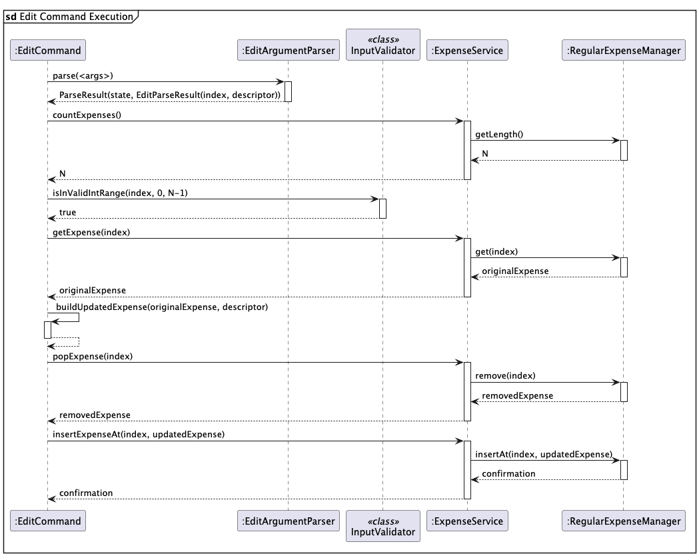

#### Step-by-Step Execution Flow
1. The user launches the application and adds some expenses into the application.

2. The user executes `/edit 2 /$ 10` to edit a regular expense with `INDEX` 2 in the list and change its `AMOUNT` to `$10` now.
   The `execute()` will call `parse(arguments)`to parse all the parameters needed to be edited.

3. The `INDEX` will be checked to see if it lies within the lower and upper bound.
   The lower bound is set to 1, while the upper bound is done by calling `countExpenses()`, on `ExpenseService`, '- 1' is because the indexes start from zero.

4. Upon validation of the index, it will call `getExpense(index)` on `ExpenseService` to get an `Expense` object: `original` to be modified.

5. An `Expense` object called `updated` will be compared with the `original` with the parameter needed to be changed.

6. Next, it will call `popExpense(index)` to remove `original` from the list and then `insertExpense(index, updated)` to insert the updated expense at the same `index`.

7. Finally, it will return a confirmation by returning `new CommandResult(true, message)` in which `message` is the successful message after updating the expense.
   This signifies the end and successful process of `/edit`.

### List Expenses
The `/list` command lists down the current list of expenses, according to the order the expenses
have been added.

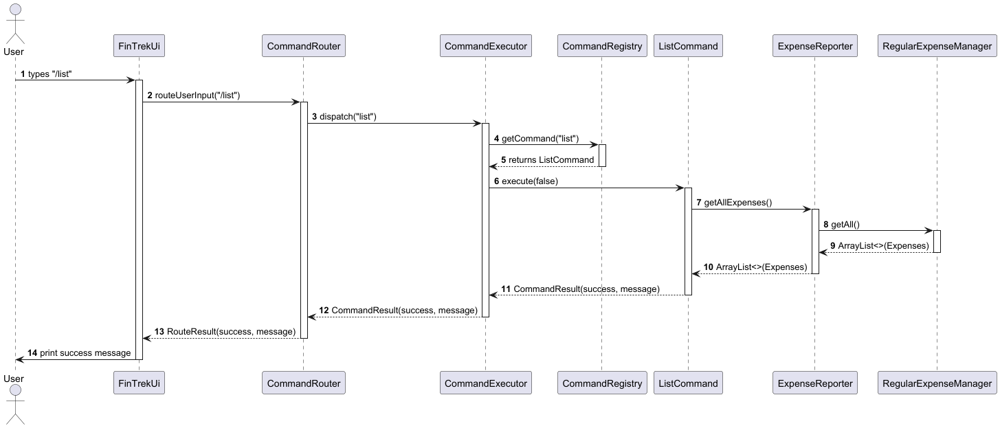

#### Step-by-Step Execution Flow
1. The user launches the application and adds some expenses into the application.
2. The user executes `/list` to view their current list of expenses.
3. `ListCommand` then proceeds to obtain the `String` equivalent of the current list
of expenses:

   - It calls `listExpenses()` on `ExpenseReporter`
   - This internally invokes `getAll()` on `RegularExpenseManager`, to which 
   `RegularExpenseManager` would return `ArrayList<>(Expenses)`, the current list of 
   expenses in the form of an `ArrayList<>` object.
   - `ExpenseReporter` executes `listExpenseBuilder(Expenses)` to obtain
   the `String` equivalent of the list of expenses from `Expenses`, an `ArrayList<>` object.
   - The list of expenses in the form of a `String` is then returned to `ListCommand`

4. `ListCommand` displays the current list of expenses along with a successful command message.

### Sorting Expenses

The `/list-sort` command enables users to display expense list in a sorted order.

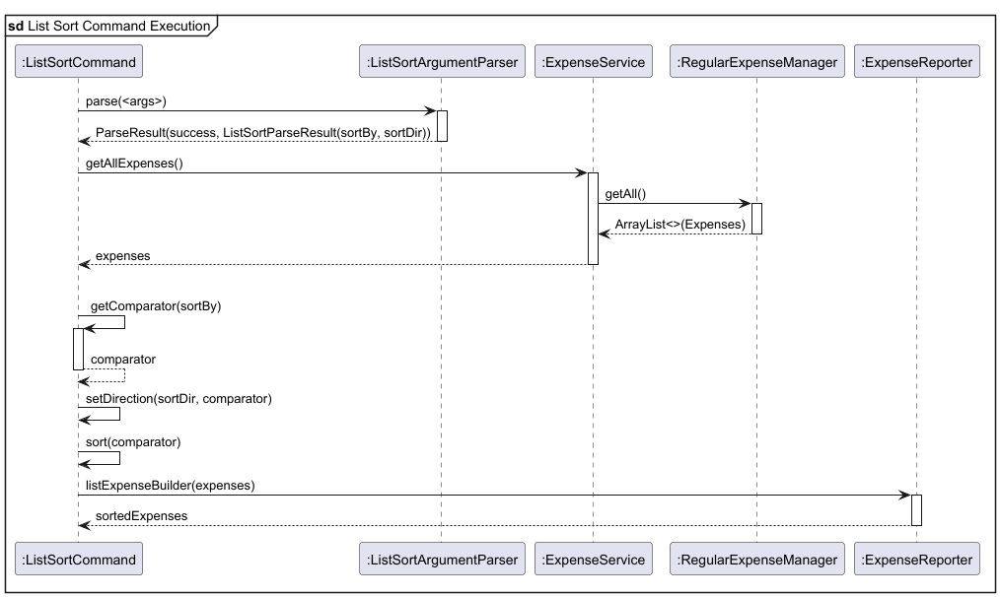

#### Step-by-Step Execution Flow
1. The user executes `/list-sort name asc` to view expense list for sorted a specific way: by `NAME` in `ASCENDING` order.
2. The `execute()` method calls `parse(<args>)` to invoke a parsing process to be explained in the **Parsing** section,
   to obtain the following parameters:
    - `<sortBy>`: condition in which list would be sorted by, in this case `NAME`
    - `<sortDir>`: direction in which list would be sorted by, in this case `ASC`
3. Using the parameters obtained, the type of comparator is determined through `getComaparator(sortBy)`,
   while `setDirection()` reverses the comparator if `sortDir` is descending.
4. The `getAllExpenses()` method in `ExpenseService` is then called,
   which retrieves an ArrayList of `Expense` objects from the `getAll()` method in `RegularExpenseManager`.
5. This list of expenses is sorted using the comparator obtained in step 3,
   and converted to a string using `listExpenseBuilder()` in `ExpenseReporter`.

### Calculating Average Expenses

The `/average` command enables users to calculate the average amount out of their
current list of expenses

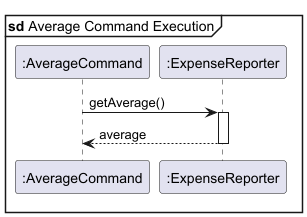

#### Step-by-Step Execution Flow

1. The user executes `/average` to get the average amount from their list of expenses.
2. `AverageCommand` invokes `getAverage()` on `ExpenseReporter`, which then returns the `average`.

### Adding Categories

The `/add-category` command enables users to add custom categories to the list of valid categories.

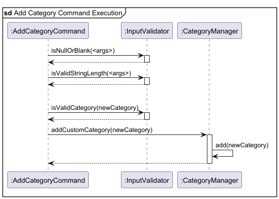

#### Step-by-Step Execution Flow
1. The user executes `/add-category shopping` to add category `SHOPPING`.
2. The command calls methods in `InputValidator` to verify if input is valid:
   - `isNullOrBlank()` checks if input is empty.
   - `containsWhiteSpace()` checks if input contains spaces.
   - `isValidStringLength()` checks if input exceeds 100 characters.
3. If input is valid, command assigns `newCategory` to the valid input
4. Command checks if category already exists by calling `isValidCategory()` in `InputValidator`, which checks validity with `CategoryManager`.
5. If category is valid, command calls `addCustomCategory()` which invokes `add()` in `CategoryManager` to successfully add category to list.

### Listing Categories

The `/list-category` command enables users to view the list of valid categories

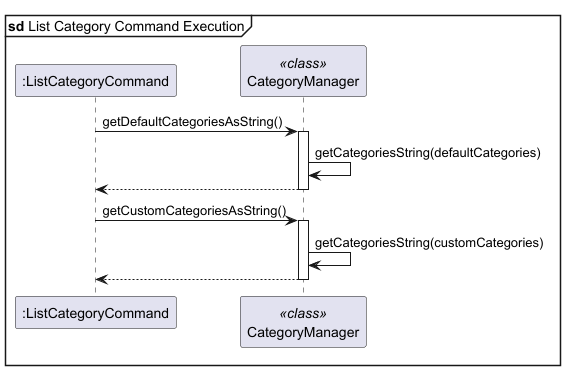

#### Step-by-Step Execution Flow
1. The user executes `/list-category` to check list of valid categories.
2. Command calls `getDefaultCategories()` and `getCustomCategories()` in `CategoryManager`
which both internally invokes `getCategoriesAsString()` to convert a Hash Set of categories to a string.
3. CategoryManager returns default and custom categories as separate strings to be combined 
to form the list of categories displayed to user.

### Setting budget

The `/budget` command enables users to set a monthly budget.

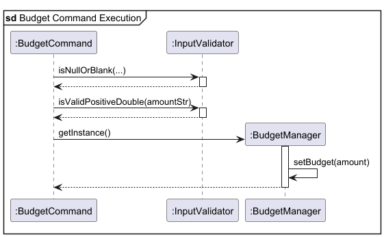

#### Step-by-Step Execution Flow
1. The user executes `/budget $100` to set budget as `100`.
2. The command calls methods in `InputValidator` to verify if input is valid:
    - `isNullOrBlank()` checks if input is empty.
    - `isValidPostiveDouble()` checks if amount is a valid double value more than 0.
3. If input amount is valid, command instantiates `BudgetManager` which internally calls `setBudget()` to set amount as budget.

### Summary of Expenses

The `/summary` command prints out the total amount spent for each category from the list of regular expenses. 
It also prints out the `HIGHEST SPENDING` category with the associated amount along with the `GRAND TOTAL` of the regular expenses.

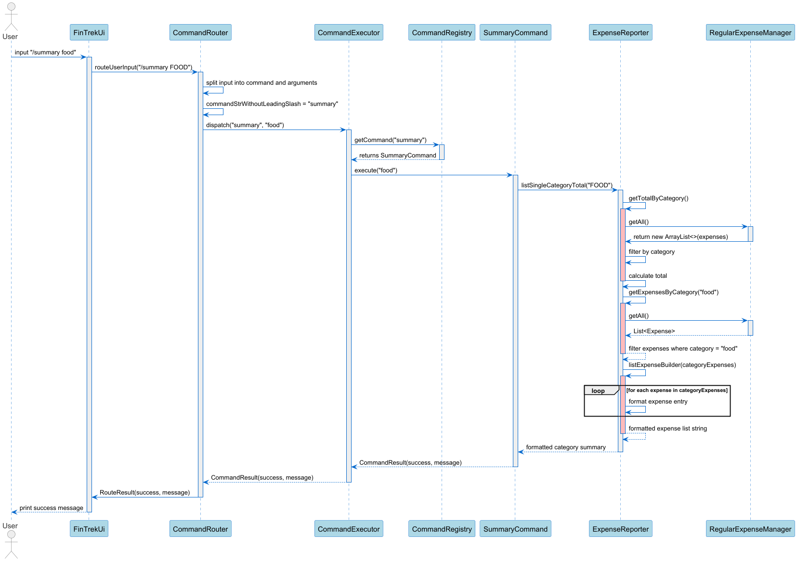

#### Step-by-Step Execution Flow
1. The user launches the application and adds some expenses into the application.

2. The user executes `/summary <args>` command to view the overall summary of the current expenses.
   The `execute()` command calls `ExpenseReporter#getTotalByCategory()` and receives `categoryTotals`, a map of the categories and their total spending. 
3. `execute()` then calls `InputValidator#isNullorBlank(<args>)` to check if `<args>` is empty.

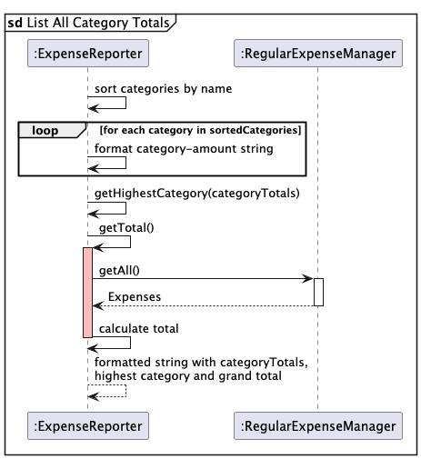

4. If `<args>` is empty, `execute()` calls `ExpenseReporter#listAllCategoryTotals(categoryTotals)`.
   - The categories are sorted by name is ascending order and formatted.
   - `ExpenseReporter#getHighestCategory` finds the category with the highest spending.
   - `ExpenseReporter#getTotal()` calculates the grand total.
   - A formatted string with all category totals, highest spending category, and grand total is returned.

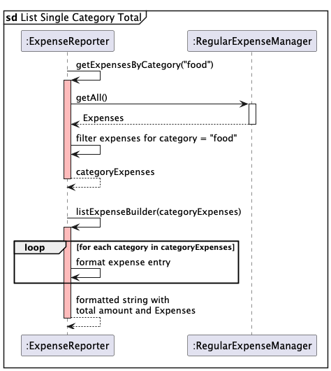

5. If `<args>` is non-empty, `execute()` calls `ExpenseReporter#listSingleCategoryTotal(categoryTotals, <args>)`.
   - For example, let `<args>` be `food`.
   - `ExpenseReporter#getExpensesByCategory("food")` filters the expense list and returns `categoryExpenses`, a list of expenses in the category `FOOD`.
   - `ExpenseReporter#listExpenseBuilder(categoryExpenses)` returns a formatted string of the expenses in the category `FOOD`.
   - A formatted string with the total spending and all the expenses in `FOOD` is returned.

6. `SummaryCommand` returns the formatted summary string to the parser, which prints the message to the user.

### Sort Command

The `/list-sort` command allows users to sort an expense list based on two parameters, `FIELD` and `DIRECTION`.

#### Step-by-Step Execution Flow

1. The user launches the application and adds some expenses into the application.

2. The user executes `/list-sort amount asc` to sort the regular expense by price in ascending order (from lowest to highest).
   The `execute()` will call `parse(arguments)` which separates the `FIELD` into `sortBy` and `DIRECTION` for ordering of expenses into `sortDir`.

3. It will then invoke `getAllExpenses()` to `ExpenseService` which will return the `ArrayList` of `Expenses`

4. Next,it will call `getComparator(sortBy)` to find the right `String` for the `Comparator<Expense>` based on the cases of `FIELD` which are `NAME`, `AMOUNT`, `CATEGORY` and `DATE`.
In this case, it would be `AMOUNT`.

5. Afterward, it will call set the direction of comparison by calling `setDirection(sortDir, comparator)`.
If sortDir is `DSC`, it will reverse the comparator since it was initially built in the `ASC` - ascending direction.

6. It will then call `sort(comparator)` to sort the expense list. 

7. Lastly, it will invoke `listExpenseBuilder(expenses)` to list out the sorted expenses in the format of numbering from "1." and so on.

### Help Command

The `/help` command allows users to get more information about the commands in the app. The user can input
a known command topic, e.g. `add`, after the `/help` command to get more information
about just the `add` command. Alternatively, if the user just keys in `/help` without additional
parameters, then information about all the commands will be displayed.

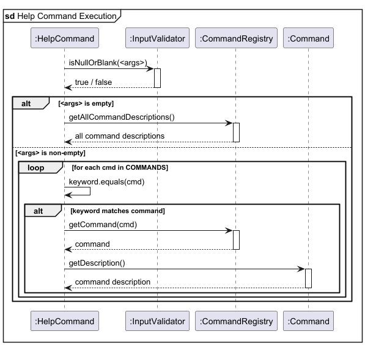

#### Step-by-Step Execution Flow
1. The user executes `/help <args>` to view more information about the commands in the app.
2. The `execute()` command calls `InputValidator#isNullorBlank(<args>)` to check if `<args>` is empty.
3. If `<args>` is empty, `execute()` calls `CommandRegistry#getAllCommandDescriptions()`. This will return
all the available command descriptions and display them to the user.
4. If `<args>` is non-empty, then `execute()` will trim whitespaces of `<args>`,
creating a String `keyword` object.
5. `execute()` will then loop through all available commands `cmd`, checking if `keyword` matches one of them. If it does:
   * `execute()` invokes `CommandRegistry#getCommand(cmd)` which will return the matched command.
   * `execute()` then calls the `getDescription()` method on the matched `Command` object to retrieve its description.
   * This description is then displayed to the user as part of the help output.

---
## Expense

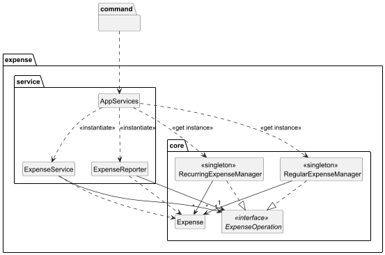

### High-Level Responsibilities & Flow

1. [Command]
   - Represents an abstract base for all user commands.
   - Each command (e.g., AddCommand, EditCommand) interacts with
     expense-related logic via the service layer.

2. [AppServices]
   - A central factory that provides pre-instantiated shared services.
   - Holds singleton instances of:
     - ExpenseService (for data manipulation)
     - ExpenseReporter (for analytics and summaries)
   - It decouples command logic from low-level object creation.

3. [ExpenseService]
   - Provides a unified API to manipulate expenses.
   - Delegates actual data operations to the appropriate expense manager
     (either regular or recurring).

4. [ExpenseReporter]
   - Offers read-only views over expense data.
   - Used for listing, calculating totals, category summaries, etc.

5. [RecurringExpenseManager] and [RegularExpenseManager]
   - Singleton classes that manage recurring and regular expenses respectively.
   - Internally maintain a list of Expense objects.
   - Both implement the shared [ExpenseOperation] interface.

6. [ExpenseOperation] (Interface)
   - Abstracts core methods like `add`, `remove`, `get`, and `clear`.
   - Allows service and reporter classes to be reused across both
     recurring and regular modes.

7. [Expense]
   - The base model class represents a single financial transaction.
   - Stores fields like description, amount, category, and date.

8. [CategoryManager]
   - Stores available categories of expenses.
   - User-defined categories can be added through the command.
  
### Example Flow

When a user runs a command like `/add`:

1. The AddCommand class (a subclass of Command) is executed.
2. Through AppServices, it obtains the correct ExpenseService instance.
3. ExpenseService adds the new Expense to either the RegularExpenseManager or RecurringExpenseManager.

If the user runs a query command like `/summary`, the command calls ExpenseReporter to aggregate data.

If the user runs `/add-category`, the command adds a new category through CategoryManager.

## Logging

`Logger.log` was used throughout the code to help the process of debugging and ensuring developers what commands or classes are called in the process.
This is set to `Level.FINE` to ensure the logs are not printed out when running the product.

## Input handling

All user inputs will be forced to be lowercase to be compared with the HashMap for the functions created for general and recurring expenses.

## Appendix A: Product Scope
### Target user profile

University Students

We would like to help students to manage their money wisely through creating a financial chatbot: FinTrek.
Hopefully, students will be more financially conscious and able to manage their budget wisely. 

### Value proposition

1. Provide easy access to track and record expenses
2. Reduce the hassle of manually calculating expenses 
3. Generate summaries and trends for user spending
4. Provide financial awareness to users
5. Simplify the process of splitting expenses amongst friends 
6. Helpful for students to manage their budget
7. More secure and portable than physical records

## Appendix B: User Stories

| Version | As a ...           | I want to ...                                                                         | So that I can ...                                                  |
|---------|--------------------|---------------------------------------------------------------------------------------|--------------------------------------------------------------------|
| v1.0    | new user           | ask the bot for a guide on the commands                                               | know how to use the application                                    |
| v1.0    | student            | add an expense into the list of expenses                                              | keep track of my expenses                                          |
| v1.0    | student            | delete an expense from the list of expenses                                           | remove something I wrongly listed                                  |
| v1.0    | lazy student       | automatically calculate statistics pertaining to my expenses                          | save a lot of time by not counting manually                        |
| v2.0    | student            | edit the details of an expense from the current list of expenses                      | have more flexibility to edit details in case I enter them wrongly |
| v2.0    | analytical student | get a summary of the total spending for each category                                 | know where most of my monthly budget goes to                       |
| v2.0    | lazy student       | set up recurring spending or expenses                                                 | save time by not adding them manually every month                  |
| v2.0    | meticulous student | sort my list of expenses based on dates, categories, or amount                        | better organize my list of expenses                                |
| v2.0    | forgetful student  | set up a budget limit or receive warnings when I will almost exceed my monthly budget | save money by not accidentally overspending                        |
| v2.0    | typical user       | save my list of expenses into a save file                                             | easily load them whenever I enter the application                  |
    

## Appendix C: Non-Functional Requirements

### 1. Usability

- The FinTrek app should be easy and intuitive to use through a Command Line Interface (CLI) -- no Graphical User Interface (GUI) required.
- Users should be able to learn the basic commands within 5 minutes with assistance from the `/help`
command or the User Guide.
- A user with above average typing speed for regular English text (i.e. not code) should be able to accomplish most of the tasks faster using commands than using the mouse.

### 2. Performance

- Commands should be processed within 1 second under normal usage (under 1000 expenses)
- The system should support up to 1000 expense entries without noticeable lag.

### 3. Portability

- The application should run on any mainstream OS with Java 17 installed (Windows, macOS, Linux, etc.).
- No installation should be required other than compiling and running the `.jar` file via a Java-compatible terminal.

### 4. Data Persistence

- All expense and budget data persists between local runs of the application as they saved to a local save file (`data.txt`).
- Saving should occur automatically after each command (`/add`, `/delete`, `/edit`, etc.).

## Appendix D: Glossary

* *Regular Expense* - An expense that has been done, usually on the day of addition of expense.
* *Recurring Expense* - An expense that is repeated monthly and will be automatically added into the regular expense list on the stipulated date.
* *Manager* - A class that helps to specify which list to target, Regular Expense or Recurring Expense list
* *ExpenseService* - A class that manages simple `ArrayList` functions such as `add()` and `remove()`.
* *ExpenseReporter* - A class that manages more complicated functions such as `getTotalByCategory()` and `getHighestCategory()`.

## Appendix E: Instructions for manual testing

### CommandRouter

**Purpose**: To verify that user input is correctly interpreted and dispatched to the appropriate command.

##### Correct behavior

1. Launch the app using `FinTrek.main()`.
2. Type the following commands one at a time:

- `/add lunch $10 /c food`  
  → Expected: Expense is added with category `food`. Success message is printed.

- `/list`  
  → Expected: Displays a list containing the added expense.

- `/delete 1`  
  → Expected: Deletes the first expense. Success message with updated count is printed.

- `/total`  
  → Expected: Displays the total amount of all current expenses.

- `/average`  
  → Expected: Displays the average amount of all current expenses.

- `/help add`  
  → Expected: Displays detailed help message for the `/add` command.

- `/add-reccuring mobile plan $20 /c utilities`
  → Expected: The expense will be added to the recurring list. This recurring expense will be added once the app restarted.

- `/add-recurring installment $10 /c utilities 01-01-2025`
  → Expected: The expense will be added to the recurring list and will be added monthly to the regular expense list on the first day of every month.
    If the input is today's date, this recurring expense will be added to the regular list upon restarting the app. 

##### Invalid command formats

Type the following commands one at a time:

- `add lunch $10`  
  → Expected: Error message — must start with '/'.

- `/blah blah`  
  → Expected: Error message — invalid command.

- *(Empty input or whitespace only)*  
  → Expected: Error message — must enter a command starting with '/'.

- `/add mobile plan $20 1-1-2025`  
  → Expected: Error message — key in '/help add' for more information

**Note:** All errors and successful command parsing are logged using the Java `Logger`.
