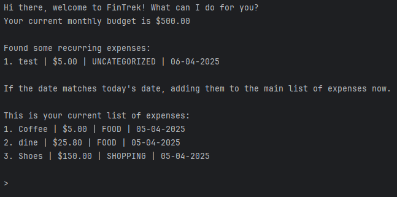

# User Guide

## Introduction

**FinTrek** is a simple and intuitive Command Line Interface (CLI) tool that helps users track their personal expenses. Users can quickly add, view, analyze, and manage their expenses using short commands. It is designed for speed, simplicity, and ease of use.

---
## Quick Start

1. Ensure that you have **Java 17** or above installed on your computer.
2. Download the latest release v2.1 `tp.jar`.
3. Copy the file into your desired folder on your computer. This folder will be set as the _home folder_ for FinTrek.
4. Open a command terminal, `cd` into the folder you put the
`.jar` file in, and use the `java -jar tp.jar` command to run the application. You will see something similar to
what is shown below.
   

5. Input some commands to start
managing your expenses or type `/help` to learn about the commands.
Alternatively, refer to the [Features](#Features) section for the full list of
commands and its details.


> #### ❗CAUTION
> - Only enter a command after you see the leading input arrow `>`. Commands will only be read in after `>`.
> - Do not enter Ctrl+C or Ctrl+Z as this will cause the program to end.

---

## Types of Expenses

### Regular Expenses

1. Users can add regular expenses into the spending list by keying in the `DESCRIPTION` and `AMOUNT`
with optional parameters `CATEGORY` and `DATE`.
2. There are functions to modify the list or a specific regular expense which are
elaborated in the Features section below.
3. Additionally, users can also set a `Budget` through our function which will send out a reminder
upon comparison of the total spending with the set budget.

### Recurring Expenses

1. A recurring expense reduces the need for users to key in their repeating monthly or yearly
expenses into a recurring expense list.
2. These expenses will be added automatically into the regular expenses list upon startup if the 
`DATE` of this recurring expense matches today's date.
3. This type of expense has similar functions above with a slight difference in format `/COMMAND-recurring`
explained further in the [Features](#features) section for [recurring expenses](#recurring-expenses-1) below.


---

## Features

---
> ### ℹ️ Notes about the command format:
>- Words in `UPPER_CASE` are the parameters which are expected from the user,
e.g. in `/add <DESCRIPTION> $<AMOUNT>`, `DESCRIPTION` is a parameter which can be input as `/add Food`.
>- Items in square brackets are optional. e.g. `/add <DESCRIPTION> $<AMOUNT> [/c<CATEGORY>] [/d<DATE>]` can be instantiated as `/add 
/Coffee $5.00 /c Beverages` or as `/add Coffee $5.00`.
>- Extraneous parameters for commands that do not take in parameters (such as `list`, `average`, or `total`) will be ignored, 
e.g. if the command specifies `list 2113`, it will be interpreted as `list`.

---
## Regular Expense

### ➕ Adding an Expense: `/add` (with `/add-category`)

Adds a new expense to your list to an **existing** category or `UNCATEGORIZED`.

**Format**:
```
/add <DESCRIPTION> $<AMOUNT> [/c <CATEGORY>] [/dt <DATE>]
```

* `<DESCRIPTION>` has a maximum character limit of `100`.
* `<AMOUNT>` must be a positive number that is no higher than `1,000,000,000`
  (one billion).
* `<DATE>` must be in the format of `dd-MM-yyyy`.
* `<CATEGORY>` will be converted to uppercase in the list of expenses.
* `/c` and `<CATEGORY>` are optional. Default is `UNCATEGORIZED`.
  * if a `NEW_CATEGORY` does not exist in the list, it must be added
  first into the list using `/add-category <NEW_CATEGORY>`.
* `/dt` and `<DATE>` are optional. Default is today's `date`

**Examples**:
```
/add Coffee $5.00 
/add Textbook $12.00 /c studies 
/add MRT $3.00 /dt 04-05-2025
```
**Example Outputs**:
```
Expense added successfully: Coffee | $5.00 | UNCATEGORIZED | 05-04-2025
Expense added successfully: Textbook | $12.00 | STUDIES | 05-04-2025
Expense added successfully: MRT | $3.00 | UNCATEGORIZED | 04-05-2025
```

---

### ❌ Deleting an Expense: `/delete` 


Removes an expense by its number in the list.

**Format**:
```
/delete <EXPENSE_NUMBER>
```

**Example**:
```
/delete 2
```

**Example Output**:
```
Expense "Coffee | $5.00 | FOOD | 05-04-2025" deleted successfully. Remaining expenses: 1
Expense "Mobile Data | $20.00 | NECESSITIES | 05-03-2025" deleted successfully. Remaining recurring expenses: 1
```

---
### ✏️ Editing an Expense: `/edit` 

Edits an existing expense's description, amount, category, or date. This allows you to fix mistakes or update details of a previously recorded expense.

**Format**:
```
/edit <INDEX> [/d <DESCRIPTION>] [/$ <AMOUNT>] [/c <CATEGORY>] [/dt <DATE>]
```

- `<INDEX>` is the 1-based position of the expense in the list (e.g., from `/list`).
- `/d`, `/$`, `/c`, and `/dt` are optional flags to update the description, amount, category, and date, respectively, but requires at least one optional flag. Their order cannot be swapped. 
- The arguments require at least a space character between the flag and the value, e.g. `/d some_description`.
- `<CATEGORY>` must be an existing category (case invariant).
- `<DESCRIPTION>` has a maximum character limit of `100` and cannot accept any string that contains '/$', '/c' and '/dt'.
- `<AMOUNT>` must be a positive number that is no higher than `1,000,000,000`
  (one billion).
- `<DATE>` must be in the format of `dd-MM-yyyy`.
- If a field is omitted, the original value will be retained.

**Example**:
```
/edit 2 /d Dinner /$ 25.00 /c Food /dt 25-12-2024
```

**Example Output**:
```
Expense at index 2 updated successfully:
Dinner | $25.00 | FOOD | 25-12-2024
```

---
### 📋 Listing Expenses: `/list` 


Displays all recorded expenses.

**Format**:
```
/list
```

If extraneous parameters are supplied to `/list`, e.g. `/list everything please`, then
`/list` would simply behave as usual and display all recorded expenses.

---
### 🗃️ Sorting Expenses: `/list-sort` 

Sorts expense list based on a specified field and sorting order.

**Format**:
```
/list-sort <SORT FIELD> <SORT DIRECTION>
```
- `<SORT FIELD>` specifies the attribute to sort by. Available options are:
   - `name` - sorts alphabetically by description,
   - `amount` - sorts by amount
   - `category` - sorts by category
   - `date` - sorts chronologically by date,
- `<SORT DIRECTION>` determines the order in which list is display, Available options are:
   - `asc` - A to Z for text, smallest to largest for numbers
   - `dsc` - Z to A for text, largest to smallest for numbers

**Example**:
```
/list-sort name asc
```
This will list out expenses sorted in ascending alphabetical order by name.

**Example Output:**
```
Expenses sorted by NAME (ASCENDING): 
1. Books | $20.00 | STUDIES | 05-04-2025
2. Coffee | $5.00 | FOOD | 05-04-2025
3. MRT | $3.00 | TRANSPORT | 05-04-2025
```

---

### 🧮 Calculating Total Expenses: `/total` 

Shows the total amount spent.

**Format**:
```
/total
```
Note that if the total amount is greater than `10,000,000,000` (ten billion),
then an error message will be returned. 

Also note that if extraneous parameters are supplied to `/total`, e.g. `/total cs2113`, then
`/total` would simply behave as usual and return the total amount spent.

---
### 📊 Calculating Average Expense: `/average` 

#### General Expense

Displays the average amount spent per recorded expense. Note that `/average` would
fail to work and will return an error message if the `total` amount of expenses in the list
exceeds `10_000_000_000` (ten billion).

**Format**:
```
/average
```

If extraneous parameters are supplied to `/average`, e.g. `/average hello!`, then
`/average` would simply behave as usual and return the average amount spent.

---
### 🛠️ Adding Custom Categories: `/add-category`

Adds a custom category to the list of valid categories.

**Format**:
```
/add-category <CATEGORY>
```

- `<CATEGORY>` has a maximum character limit of `100`, and cannot contain any whitespace.

**Example**:
```
/add-category shopping
```

**Example Output**:
```
Category added successfully: SHOPPING
```

---
### 📒 Listing Categories: `/list-category`

Displays list of valid categories, separated by default and custom.

**Format**:
```
/list-category
```

---

### 💲Setting Monthly Budgets: `/budget`
Sets a monthly budget limit which will be the default for each month.

**Format**
```
/budget $<AMOUNT>
```
- `<AMOUNT>` must be a positive number greater than 0 and no higher than `1,000,000,000` (one billion).

**Example:**
```
/budget $500
```

**Example Output:**
```
Monthly budget successfully set to $500.00
```

---

### 💸 Budget Left

Outputs the current monthly budget, total expenses and budget left, as a percentage as well.

**Format**
```
/budget-left
```

**Example Output:**
```
Your budget is currently $500.00.
Total expenses: $180.80 
Monthly budget left: $319.20 (63.84% remaining)
```

---

### ❗Budget Warnings
Budget warnings will be generated when the
monthly budget is exceeded or almost exceeded (10% short of being exceeded).

**Format (if 10% short of reaching monthly budget limit):**
```
WARNING: You are $<BUDGET - TOTAL_EXPENSES> short of reaching your monthly budget of $<BUDGET>
```

**Format (if exceeded monthly budget limit):**
```
WARNING: You have exceeded your monthly budget of $<BUDGET> by $<TOTAL_EXPENSE - BUDGET>
```

**Example**:

Assuming the monthly budget is set to `$500.00` and the list of expenses is
currently empty, if the user adds the following expenses:
```
/add Phone $450
/add Wine $700
```

then they can expect the following output.

**Example Output**:
```
WARNING: You are $50.00 short of reaching your monthly budget of $500.00
WARNING: You have exceeded your monthly budget of $500.00 by $200.00 
```

---


### 📝 Getting Summary: `/summary` 

Shows a brief summary of the current general expenses. This includes
the spending per category, the category which contributes to the
highest spending, and the grand total. Alternatively, include a category
to view the total spending and the expenses in that category.

**Format:**
```
/summary [CATEGORY]
```

**Example:**
```
/summary Food
```
This returns the total spending in the category `FOOD`, 
as well as the expenses in this category.

```
Summary of expenses: 
FOOD             : $31.30
1. Coffee | $5.50 | FOOD | 03-03-2025
2. Dinner | $25.80 | FOOD | 03-04-2025
```

---

## Recurring Expenses

* The same restrictions of the input parameters for the commands apply with an extra
`-recurring` as the argument. Note that this does not apply to the commands `add-category`, `list-category`, and `budget`.

* The recurring expense will automatically be added to the list of expenses
  upon startup if
  `DATE` is today's date or before today's date.
* Note that if the recurring expense is already in the list,
  then no more duplicates of it will be added upon startup.

**Example**:
```
/add-recurring Mobile Data $20.00 /c Necessities /dt 05-03-2025
/delete-recurring 1
/list-recurring
/list-sort-recurring category dsc
/summary-recurring
```

**Example Outputs**:
```
Recurring expense added successfully: Mobile Data | $20.00 | NECESSITIES | 05-03-2025
Expense "test | $5.00 | UNCATEGORIZED | 06-04-2025" deleted successfully. Remaining recurring expenses: 0
```
---

#### Insertion of recurring expenses upon startup
Assuming today's date is `05-04-2025`, and that the user has no budget
or other expenses yet, then upon startup, the user
can expect to see the following output:
```
Hi there, welcome to FinTrek! What can I do for you?
You have not set a monthly budget yet. Set one now!

Found some recurring expenses: 
1. Coffee | $5.50 | UNCATEGORIZED | 04-03-2025
2. Mobile Data | $20.00 | NECESSITIES | 05-03-2025

If they are due, adding them to the main list of expenses now.

This is your current list of expenses: 
1. Coffee | $5.50 | UNCATEGORIZED | 04-03-2025
2. Mobile Data | $20.00 | NECESSITIES | 05-03-2025
```

## Extra Features

### 🆘 Getting Help: `/help`

Shows help messages for commands.

**Format (general help)**:
```
/help
```

**Format (specific command)**:
```
/help <COMMAND>
```

**Example**:
```
/help add
```

**Example Output:**
```
Format: /add <DESCRIPTION> $<AMOUNT> [/c <CATEGORY>] [/dt <DATE>]
AMOUNT must be a positive number greater than 0.
CATEGORY is an optional argument.
DATE is an optional argument which must be in the form dd-MM-yyyy.
Example: /add concert tickets $35.80 /c LEISURE /dt 03-05-2025 -
         adds a regular expense with description 'concert tickets' with the amount $35.80,
         category 'LEISURE' and date '03-05-2025'.
```


---

### 👋 Exiting the program: `bye`

Exits the program.

**Format: `bye`**

---

### ✅ Saving the data
FinTrek saves data of your expenses automatically in the hard disk
using a save file called `data.txt`. There is no need to save manually.

---

### ✏️ Editing the data file
FinTrek data are saved automatically inside a local `data.txt` file.
Advanced users who know what they are doing are welcome to update
their list of expenses directly by editing the txt file.

> #### ❗CAUTION
> - If your changes to one of the lines in the data file makes its format invalid, that line will be skipped
>by FinTrek, and it will notify you on the Command Line.
> - Hence, that particular expense will not be included in your list of expenses.
> - Only update the data directly by editing the data file if you are
> confident that you are making the right changes, following the 
> correct format.
> - Do not delete the save file while FinTrek is running! Doing so
will cause any budget or expense updates you did in the session to not be saved,
and might even cause an unexpected behaviour.

---

## FAQ

**Q**: How do I transfer my data to another computer?

**A**: Install the app in another computer and simply overwrite the empty `data.txt` save file
it creates with the `data.txt`save file that contains all your previous data.

**Q**: Can I use this app in other languages?

**A**: Currently, FinTrek only supports the English language.
Inputting foreign characters to command arguments might therefore cause
unexpected behaviour.

**Q**: Do I need an internet connection to use this app?

**A**: Nope! FinTrek is readily available to use offline.


---

## Command Summary

Here’s a quick cheat sheet of commands:

| Command             | Format                                                                        | Description                                                                         |
|---------------------|-------------------------------------------------------------------------------|-------------------------------------------------------------------------------------|
| Add Expense         | `/add <DESCRIPTION> $<AMOUNT> [/c <CATEGORY>] [/dt <DATE>]`                   | Adds a new expense                                                                  |
| Add Category        | `/add-category <CATEGORY>`                                                    | Adds a new category to be used for both types of expenses                           |
| Delete Expense      | `/delete <EXPENSE_NUMBER>`                                                    | Deletes an expense by its index                                                     |
| Edit Expenses       | `/edit <INDEX> [/d <DESCRIPTION>] [/$ <AMOUNT>] [/c <CATEGORY>] [/dt <DATE>]` | Edits an existing expense                                                           |
| List Expenses       | `/list`                                                                       | Lists all expenses                                                                  |
| Total Expense       | `/total`                                                                      | Shows total expenses                                                                |
| Average Expense     | `/average`                                                                    | Shows average expense                                                               |
| Set Monthly Budget  | `/budget $<AMOUNT>`                                                           | Sets monthly budgets, and generate warnings if almost exceeded / exceeded           |
| Budget Left         | `/budget-left`                                                                | Gives a brief summary of the current budget, total expenses and monthly budget left |
| Summary of Expenses | `/summary`                                                                    | Gives a brief summary of the expenses in the list                                   |
| Sort the Expenses   | `/list-sort <SORT FIELD> <SORT DIRECTION>`                                    | Sorts out the list based on the field and direction chosen                          |
| Add Category        | `/add-category <CATEGORY>`                                                    | Adds a category for regular expenses to use                                         |
| List Categories     | `/list-category`                                                              | Lists out all valid and present categories                                          |
| Help                | `/help [COMMAND]`                                                             | Shows help for all or specific cmd                                                  |
| Bye                 | `bye`                                                                         | Exits the program                                                                   |

### Recurring Expenses

| Command             | Format                                                                                  | Description                                                 |
|---------------------|-----------------------------------------------------------------------------------------|-------------------------------------------------------------|
| Add Expense         | `/recurring <DESCRIPTION> $<AMOUNT> [/c <CATEGORY>] /dt <DATE>`                         | Adds a new recurring expense to be added at stipulated date |
| Add Category        | `/add-category <CATEGORY>`                                                              | Adds a new category to be used for both types of expenses   |
| Delete Expense      | `/delete-recurring <EXPENSE_NUMBER>`                                                    | Deletes a recurring expense by its index                    |
| Edit Expenses       | `/edit-recurring <INDEX> [/d <DESCRIPTION>] [/$ <AMOUNT>] [/c <CATEGORY>] [/dt <DATE>]` | Edits a recurring expense                                   |
| List Expenses       | `/list-recurring`                                                                       | Lists all recurring expenses                                |
| Total Expense       | `/total-recurring`                                                                      | Shows total recurring expenses                              |
| Average Expense     | `/average-recurring`                                                                    | Shows average recurring expense                             |
| Summary of Expenses | `/summary-recurring`                                                                    | Gives a brief summary of the recurring expenses in the list |
| Sort the Expenses   | `/list-sort-recurring <SORT FIELD> <SORT DIRECTION>`                                    | Sorts out the list based on the field and direction chosen  |


---

